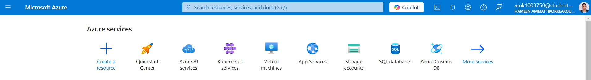
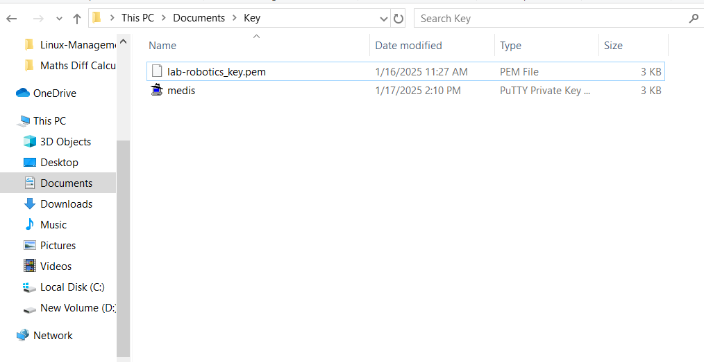
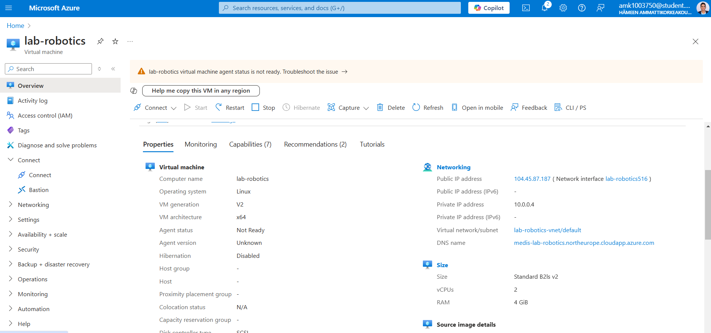
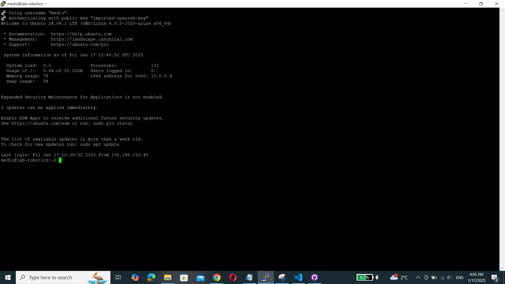

# Linux Management_Pramoda Medis

 Pramoda Medis, PramoGIT, pramoda.medis@student.hamk.fi

# Exercise 01

Task Summary: Create a Virtual Machine in Azure

1. Azure Account Setup:
Created a new Azure account for myself using my HAMK student ID pramoda.medis@student.hamk.fi

2. Create a Virtual Machine:
Selected 24.04 LTS gen 2 Server published by Canonical.

3. Connected to the Virtual Machine:
Connected to the virtual machine by downloading PyTTY asp the instructions given and also recommended to instal 64-bit x86 MSI package of PuTTY.

## Important Notes
Used the Virtual Machine's public IP address and my SSH key to connect via PuTTY.

## Find below the screenshots of the same,

