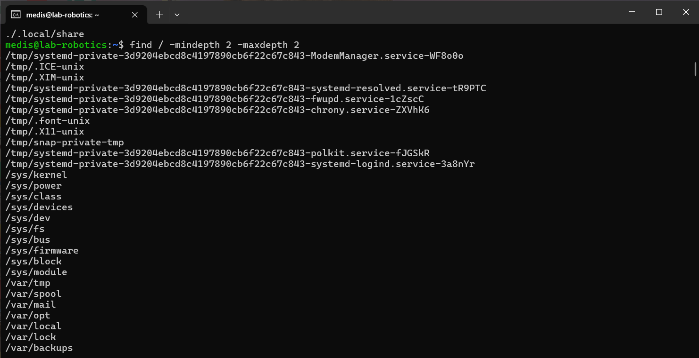
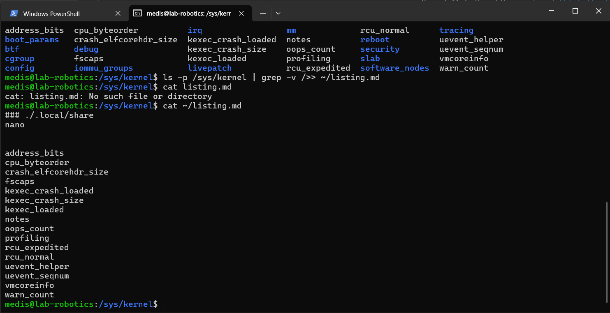
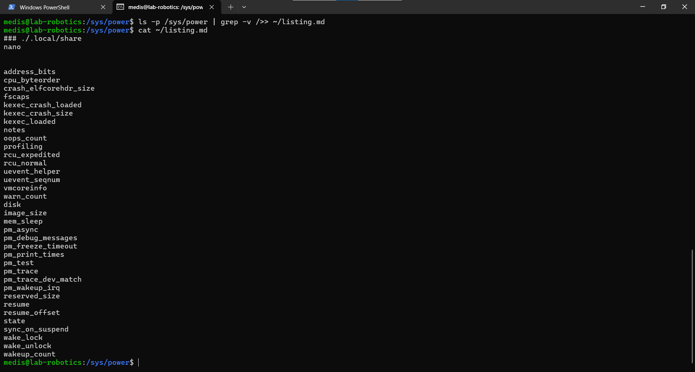
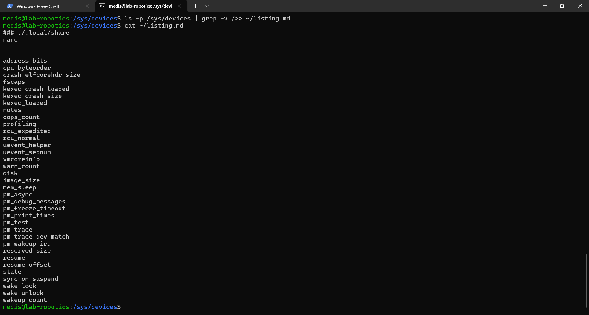
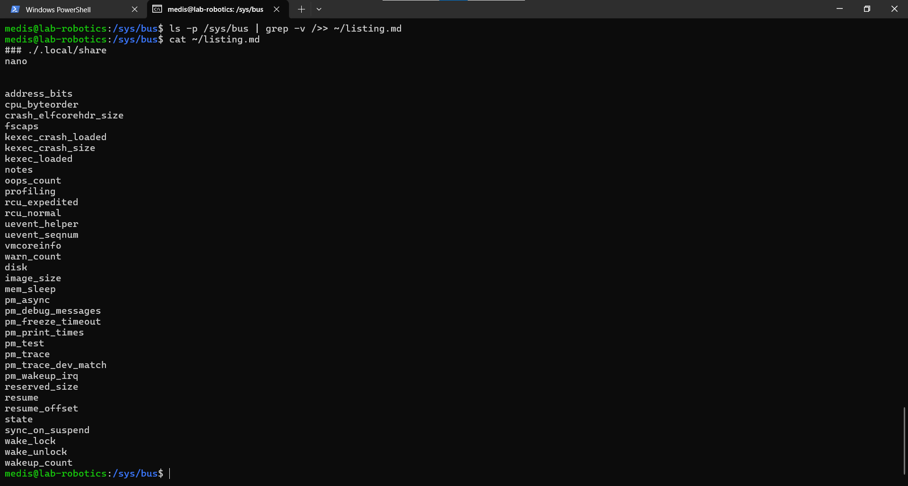

# Linux Management_Pramoda Medis

Pramoda Medis, PramoGIT, pramoda.medis@student.hamk.fi

# Exercise 02

Select five level 2 directories and save their contents in one file, "listing.md". Here "level 2" directory is for example /home/mylogin/, but not /tmp/ (level 1) or /usr/local/bin/ (level 3). Contents = listing of filenames.

1. Select five level 2 directories and save their contents in one file, "listing.md"

Selected five level 2 directories and save their contents in one file, "listing.md"

# Gave the commands as below 

find / -mindepth 2 -maxdepth 2
cd /sys/class
ls
ls -p /sys/class | grep – v />> listing.md
cat listing.md

Find attached screenshots for the same

