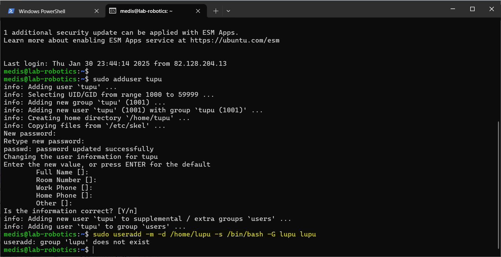
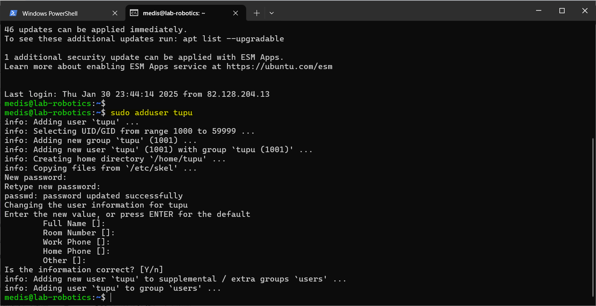
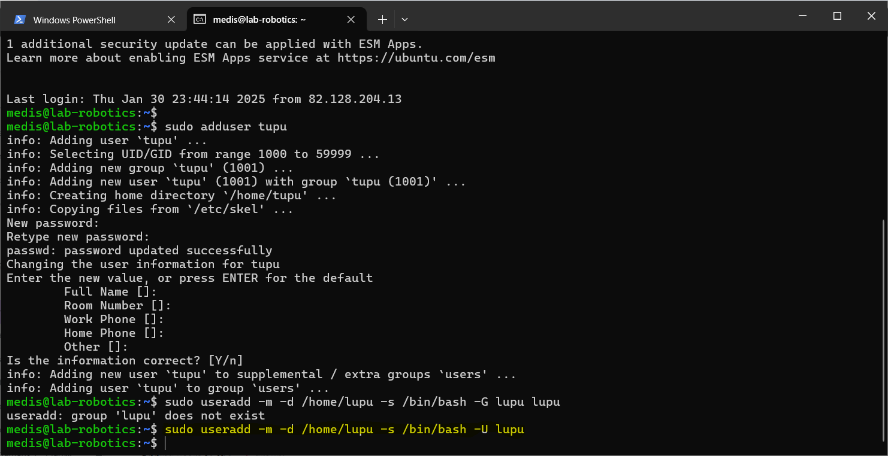
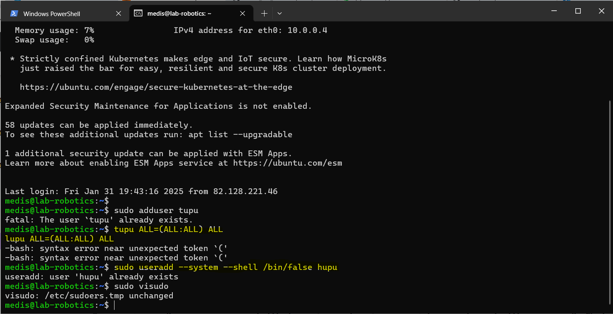
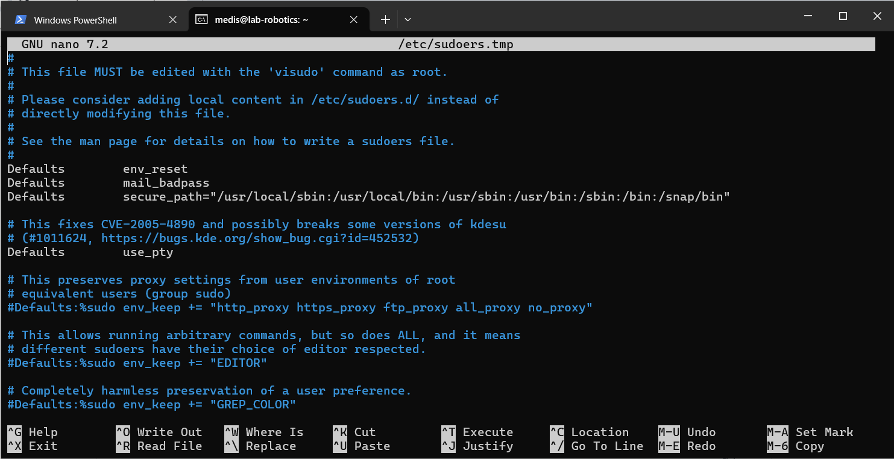
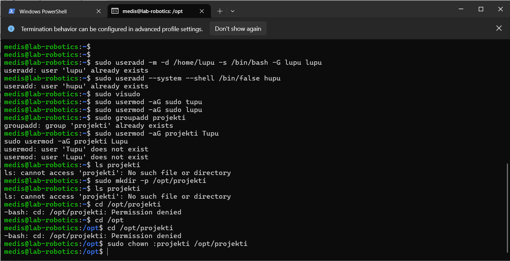
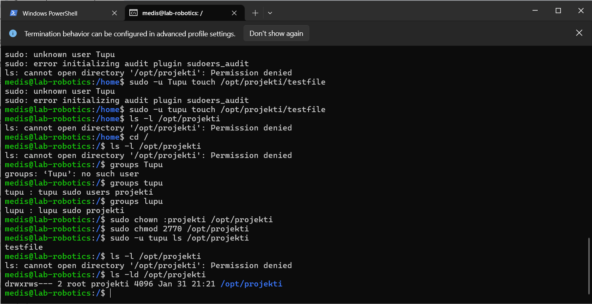

# Linux Management_Pramoda Medis

Pramoda Medis, PramoGIT, pramoda.medis@student.hamk.fi

# Exercise 03

TASK:
Task is to create users and use created users to test out file access permissions

Task will instruct you to create some users and make changes to file system. This task should be completed on your Virtual Machine. Make sure to make notes when you advance through the task to make documentation at the end of the task.

1. Create the Tupu user using the adduser script:

sudo adduser tupu

2. Create the Lupu user using the useradd command. Try to create a user profile, home directory, and user group similar to Tupu.

sudo useradd -m -d /home/lupu -s /bin/bash -G lupu lupu

-m: Create the user's home directory.

-d /home/lupu: Specify the home directory path.

-s /bin/bash: Set the login shell to /bin/bash.

-G lupu: Add the user to the lupu group.

3. Create the Hupu system user with the login shell set to /bin/false

sudo useradd --system --shell /bin/false hupu

--system: Create a system account.
--shell /bin/false: Set the login shell to /bin/false to prevent login.

4. Add the users Tupu and Lupu to the sudo users.
You can use the visudo command to edit the sudoers file directly, or add the users to the sudo group:

Using visudo to edit sudoers file:
sudo visudo
Add the following lines:

tupu ALL=(ALL:ALL) ALL

lupu ALL=(ALL:ALL) ALL

Adding users to the sudo group:

sudo usermod -aG sudo tupu

sudo usermod -aG sudo lupu

5. Create a directory /opt/projekti and add both users (Tupu and Lupu) as owners. Only Tupu and Lupu should have access to list files in the directory, read, and modify them.

## Steps
1. Create the projekti Group:

sudo groupadd projekti

2. Created the directory:

sudo mkdir /opt/projekti

3. Added Tupu and Lupu to the projekti group:

sudo usermod -aG projekti tupu

sudo usermod -aG projekti lupu

4. Set group ownership and permissions:

sudo chown :projekti /opt/projekti

sudo chmod 2770 /opt/projekti

5. Verify Access

sudo -u tupu ls /opt/projekti

## End Result

With SetGID, no matter who creates a file, it will always belong to projekti, making it easy for Tupu and Lupu to share files without permission issues.
