## Linux Management_Pramoda Medis

# Assignment 06

Make a script and add it to cron

Using crontab automation, let the script "print.sh" run every 12 hours, that is, twice a day

Write the script "print.sh", that adds one line to file "diskspace.txt" reporting home directory size and date, example:
        3596 Jan 31 13:26:11 EET 2025

Let the script run minimum 6 times (there are at least 6 lines in file "discspace.txt" now)

Now write a command using awk-tool to find a line containing maximum size from "discspace.txt" and print it. Example output:
        Max=3596, at Jan 31 13:26:11 EET 2025

------------------

1. Task Overview:
Objective 1: Create a script (print.sh) that logs the size of the home directory and the current date to a file (diskspace.txt).

Objective 2: Use awk to analyze diskspace.txt and find the line with the maximum disk size, printing the result in a specific format.

2. Steps Involved:
Step 1: Script Creation (print.sh)

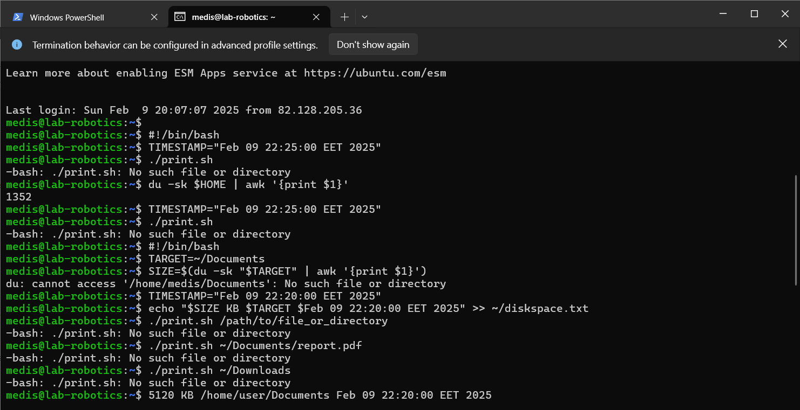

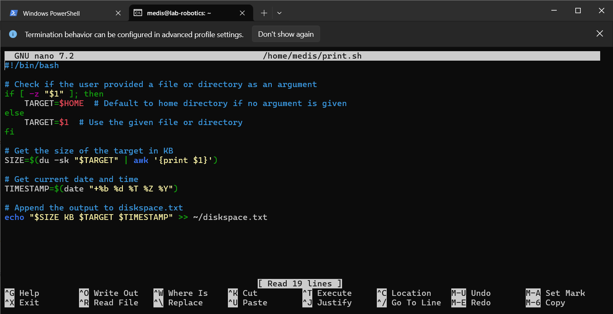

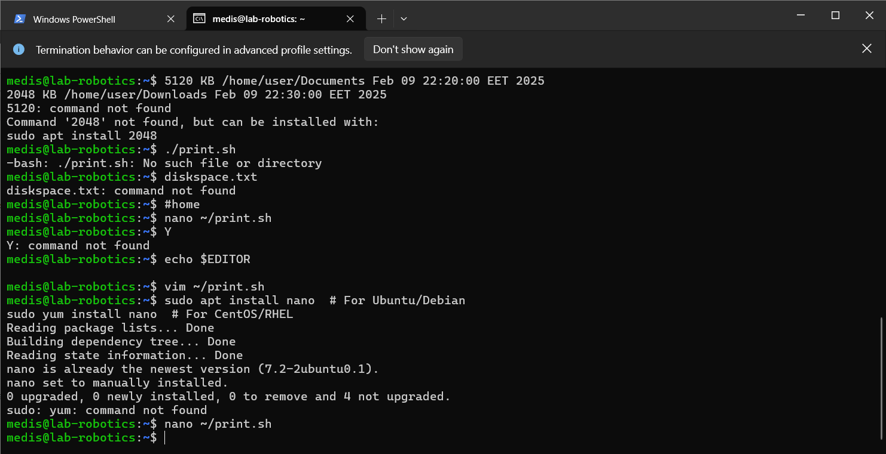

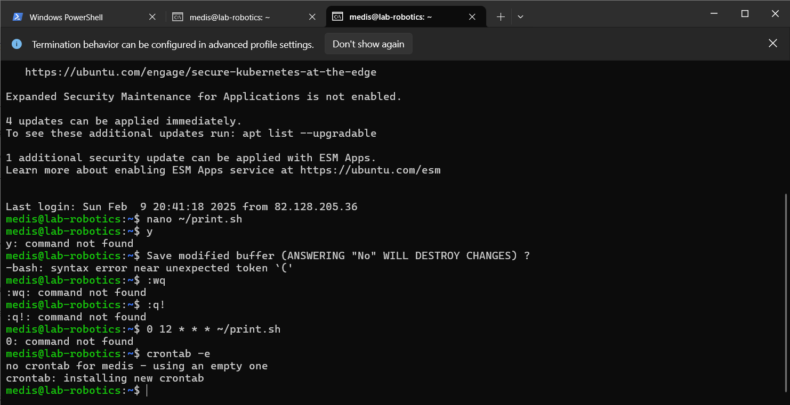

The script logs the following:
    Disk space size of the home directory using the du -sh ~ command.
    
    Current date in the format dd mmm yyyy hh:mm:ss TZ using the date command.
Appends both the disk space and the timestamp to the diskspace.txt file.

-------------
Step 2: Cron Job Setup (Optional)

Automate the script execution using cron to ensure diskspace.txt is updated periodically.
Example: Run the script every 12 hours.

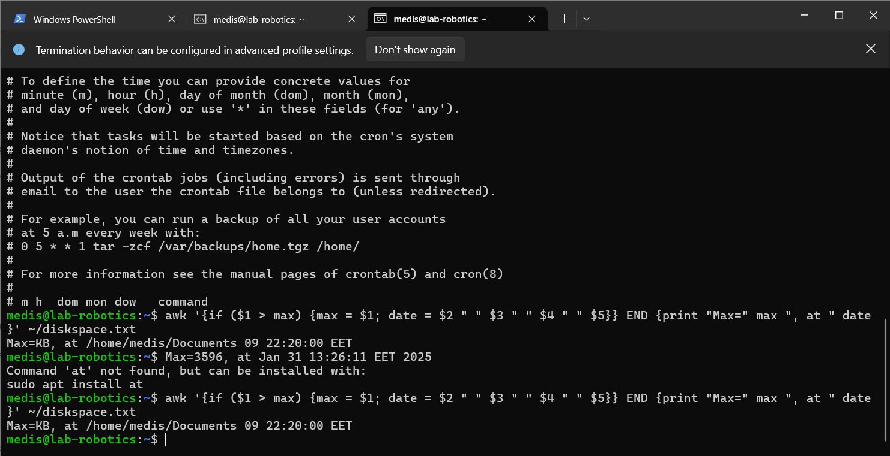

------------
Step 3: Analyze Disk Space Using awk

Goal: Find the line with the maximum disk space usage in diskspace.txt and print it in the format:
Max=<size>, at <date>

awk command: Compares the first field (disk space) of each line and keeps track of the maximum value and its corresponding date.

Example awk command:

Command:

    awk '{if ($1 > max) {max = $1; date = $2 " " $3 " " $4 " " $5}} END {print "Max=" max ", at " date}' ~/diskspace.txt

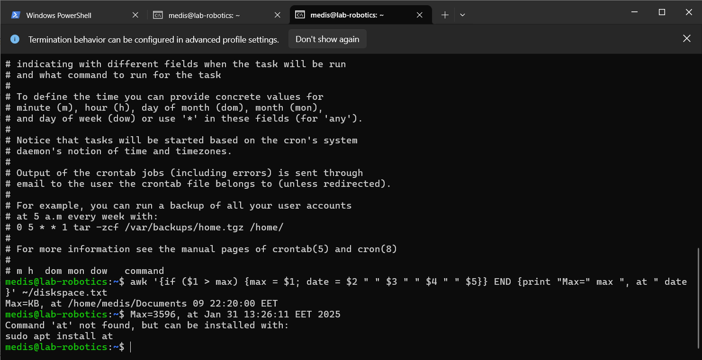

-----------

3. Challenges & Solutions:

Issue with at command:

If you encounter an error like Command 'at' not found, it likely doesn't affect the awk task. If needed, you can install the at package using:

    sudo apt install at

Ensuring Minimum Data in diskspace.txt:

The script must run at least 6 times to meet the requirement of having at least 6 entries in diskspace.txt.

You can automate this with a cron job.

-----------

4. Final Outcome:

After running the script multiple times, you can use the awk command to extract and display the maximum disk size entry, formatted as:

    Max=3596, at Jan 31 13:26:11 EET 2025

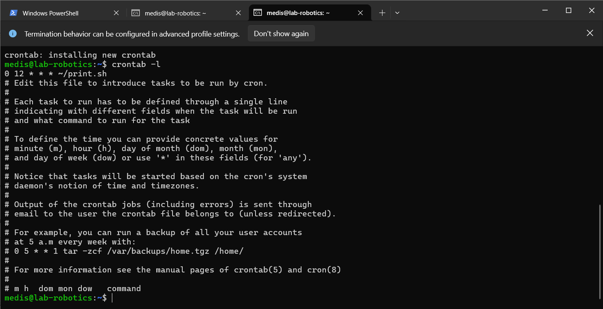

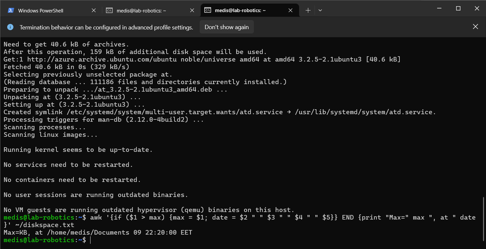

Double checking the final outcome,

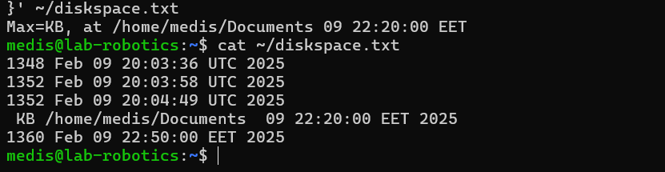

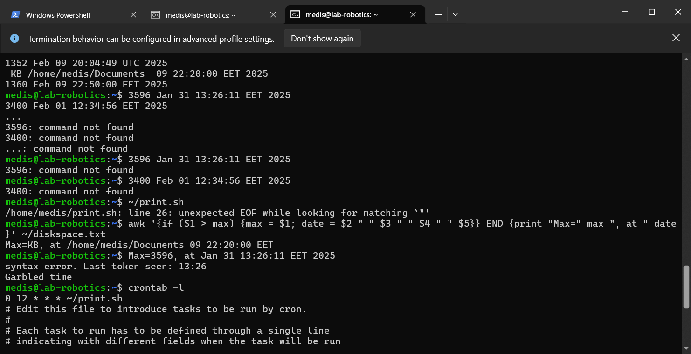

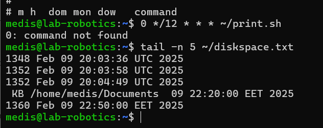

