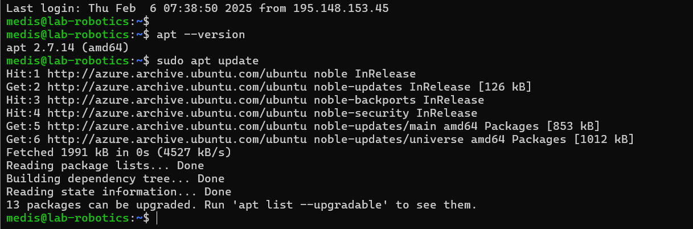

## Linux Management_PramodaMedis

# Assignment 06

# Part 1: Understanding APT & System

## 1. Check your system’s APT version:

Run the following command to display the installed APT version:

    apt --version

## 2. Update the package list:

Run the command:

    sudo apt update

#### Question: Explain why this step is important.

It is important because it refreshes the package list, ensuring the system knows about the latest available software updates and security patches.

Reasons are as follows,

    1.Refreshes Package List

    2.Security Updates

    3.Bug Fixes

    4.Dependency Management

    5.Prepares for Upgrades

## 3. Upgrade installed packages:

Run:

    sudo apt upgrade -y

#### Question: What is the difference between update and upgrade?

    Update, only fetches new package information.

    Upgrade, actually installs the latest available updates for installed packages.

#### 4. View pending updates

Run:

    apt list --upgradable

Take note of any pending updates

# Part 2: Installing & Managing Packages

#### 5. Search for a package using APT:

Find an image editor using:

apt search image editor

selected - zim

    apt show zim

Pick one package from the list and write down its name.

#### 6. View package details:

Get detailed information about the selected package:

Key Dependencies of Zim

1. Python (python3) – Required for scripting and plugin support.

2. GTK (gir1.2-gtk-3.0) – For the graphical user interface.

3. Desktop integration libraries – Such as xdg-utils for handling files and URLs.

#### 7. Install the package:

Run:

    sudo apt install zim -y

Confirm that the package is successfully installed.

#### 8.Check installed package version:

Run:

    apt list --installed | grep zim

#### Question: What version was installed?

# Part 3: Removing & Cleaning Packages

#### 9.Uninstall the package:

Run:

    sudo apt remove zim

Is the package fully removed?

    This removes the package but keeps its configuration files.

#### 10. Remove configuration files as well:

Run:

    sudo apt purge zim

#### Question: What is the difference between remove and purge?

    Remove, deletes the program but keeps its settings.

    Purge, deletes the program and its settings completely.

#### 11. Clear unnecessary package dependencies:

Run:

    sudo apt autoremove -y

#### Question: Why is this step important?

    It removes unused dependencies (packages installed with other software but no longer needed), freeing up space on your system.

    Helps keep your system clean and efficient.

#### 12. Clean up downloaded package files:

Run:

    sudo apt clean

#### Question: What does this command do?

    This removes all the downloaded package files (.deb files) from the local cache in /var/cache/apt/archives/.

    These files are usually saved to make future installations faster, but once installed, they are no longer needed and just take up space.

# Part 4: Managing Repositories & Troubleshooting

#### 13. List all APT repositories:

Run:

    cat /etc/apt/sources.list

#### Question: What do you notice in this file?

    Repository URLs:
    Each line lists a repository, including the server URL and the type of packages available (e.g., main, universe, security).

    Comments:
    Lines starting with # are comments and are not active. These are typically used to explain repository details or disable certain repositories.

    Repository types:
    You'll see entries like deb (binary packages) or deb-src (source packages).

#### 14. Add a new repository:

Run:

    sudo add-apt-repository universe
    sudo apt update

#### Question: What types of packages are found in the universe repository?

    The universe repository contains community-maintained, open-source packages that are not officially supported by Ubuntu.
    
    It includes a wide range of software, such as tools, libraries, and applications not found in the main repository.
    
    These packages are stable but maintained by the community.

#### 15. Simulate an installation failure and troubleshoot:

Try installing a non-existent package:

    sudo apt install fakepackage

What error message do you get?

Restarted the system from the terminal

    sudo reboot

How would you troubleshoot this issue?

    Check the Package Name
    Update Package List
    Check Enabled Repositories
    Search in Other Sources
    Check for Typo in the Package Name

# Bonus Challenge

Use apt-mark to hold and unhold a package so it doesn't get updated:

    sudo apt-mark hold zim
    sudo apt-mark unhold zim

#### Question: Why would you want to hold a package?

    Preventing unintended upgrades
    Stability
    Testing or compatibility