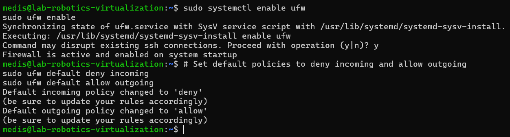
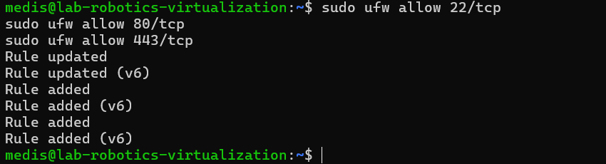
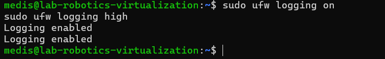
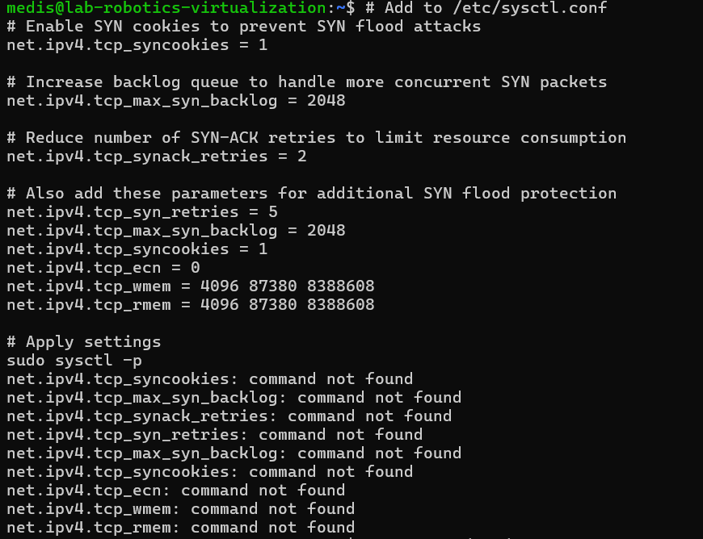
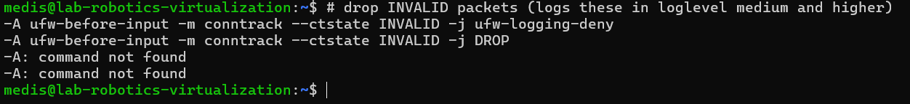
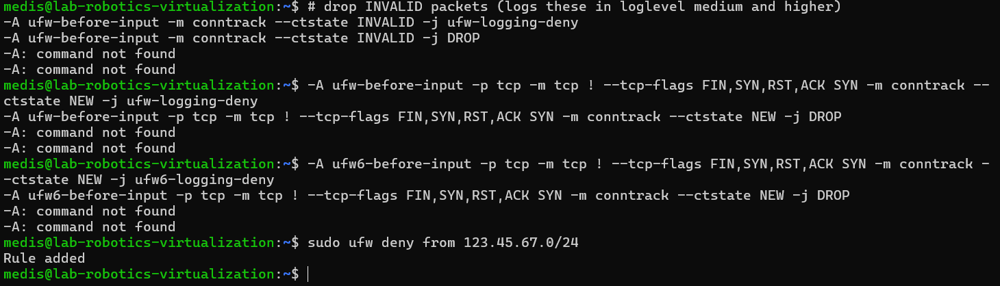
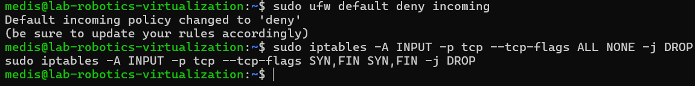
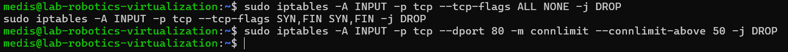
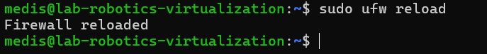
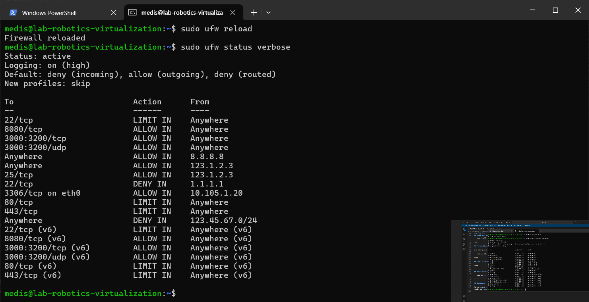

## Linux Management_Pramoda Medis

# Assignment 08

Task:

Create a firewall for your server that loads when the server starts. Define the following services for the firewall:

## Firewall Configuration Report

This report outlines the firewall rules configured for the server to protect it from unauthorized access and common network attacks. The firewall is designed to load automatically on server startup and includes rules for allowing essential services, logging connections, and mitigating specific types of attacks.

### Firewall Rules

1. Enable UFW on system start

        sudo systemctl enable ufw
        
        sudo ufw enable

2. Default Policies

Rule: Set default policies to deny incoming and allow outgoing
        
        sudo ufw default deny incoming

        sudo ufw default allow outgoing

### Allow Essential Services

Rule: Allow incoming traffic on ports 22 (SSH), 80 (HTTP), and 443 (HTTPS).

These rules ensure that the OpenSSH server (for remote administration) and the HTTP/HTTPS servers (for web traffic) are accessible to users while blocking all other unnecessary ports.

    sudo ufw allow 22/tcp

    sudo ufw allow 80/tcp

    sudo ufw allow 443/tcp
    

### Logging Rules

Rule: Log all blocked connections and allowed connections.

Enabling logging helps in monitoring and auditing firewall activity. The high logging level ensures detailed logs for both allowed and denied traffic, which is useful for troubleshooting and security analysis.

### Prevent SYN Flood Attacks

Rule: Limit the rate of incoming connections to mitigate SYN flood attacks.

SYN flood attacks overwhelm the server with half-open TCP connections. The limit rule restricts the number of connections per IP address, reducing the impact of such attacks.

### ok icmp codes for INPUT
-A ufw-before-input -p icmp --icmp-type destination-unreachable -j ACCEPT
-A ufw-before-input -p icmp --icmp-type time-exceeded -j ACCEPT
-A ufw-before-input -p icmp --icmp-type parameter-problem -j ACCEPT
-A ufw-before-input -p icmp --icmp-type echo-request -j ACCEPT

### ok icmp code for FORWARD
-A ufw-before-forward -p icmp --icmp-type destination-unreachable -j ACCEPT
-A ufw-before-forward -p icmp --icmp-type time-exceeded -j ACCEPT
-A ufw-before-forward -p icmp --icmp-type parameter-problem -j ACCEPT
-A ufw-before-forward -p icmp --icmp-type echo-request -j ACCEPT

### Block Common Attack Vectors

Rule: Block ICMP (ping) requests to prevent ping-based attacks.

ICMP requests can be used for reconnaissance or denial-of-service attacks. Blocking them reduces the attack surface.

Rule: Block traffic from known malicious IP ranges.

This rule blocks traffic from specific IP ranges that are known to be sources of malicious activity.

    sudo ufw deny from 123.45.67.0/24

### Default Deny Policy

Rule: Deny all incoming traffic by default.

A default deny policy ensures that only explicitly allowed traffic is permitted, reducing the risk of unauthorized access.

    sudo ufw default deny incoming

### Additional Attack Prevention Measures

Rule: Use iptables to drop packets from IPs that attempt port scanning.

These rules drop packets that match common port-scanning patterns, making it harder for attackers to discover open ports.

    sudo iptables -A INPUT -p tcp --tcp-flags ALL NONE -j DROP

    sudo iptables -A INPUT -p tcp --tcp-flags SYN,FIN SYN,FIN -j DROP

### Prevent DDoS Attacks

Rule: Use iptables to limit the number of concurrent connections.

This rule limits the number of concurrent connections to the HTTP server, reducing the impact of DDoS attacks.

    sudo iptables -A INPUT -p tcp --dport 80 -m connlimit --connlimit-above 50 -j DROP

### Then, reload UFW:

### Verification and Monitoring

    sudo ufw status verbose

### Conclusion

The configured firewall provides robust protection for the server by allowing only essential services, logging all traffic, and mitigating common attacks such as SYN floods, port scanning, and DDoS. The rules are designed to balance security and functionality while ensuring the server remains accessible for legitimate use.

