# Linux Management_Pramoda Medis

## Assignment 01 (6p)

Install gcc

Make a small C program "mycalc.c" to ask user 2 numbers, and print the sum
Install Node.js and npm. Make a new directory "myserver", cd there and install Express web server
Copy example javascript code to "myserver.js" and modify it to use also route "/user" that returns information about client user (Hint: use process.env)
Install python3 and pip
install bpytop (, run, and take screenshot)
Return in one zip file containing mycalc.c and myserver.js, and screenshot (jpg/png) from bpytop screen

1. Install GCC (GNU Compiler Collection)

To install GCC, use the following commands based on your operating system:

        sudo apt update
        
        sudo apt install gcc

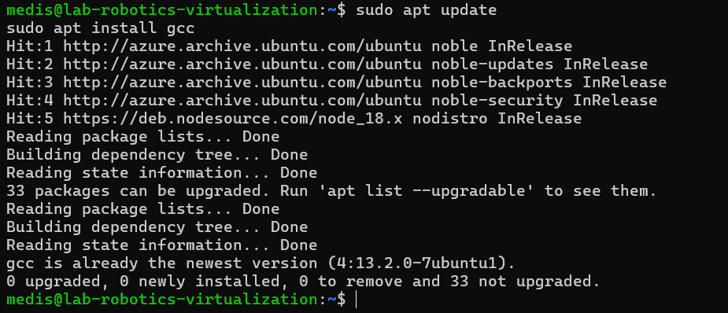

Install gcc

Already have installed gcc compiler we do not need to install the compiler again.

        - gcc --version

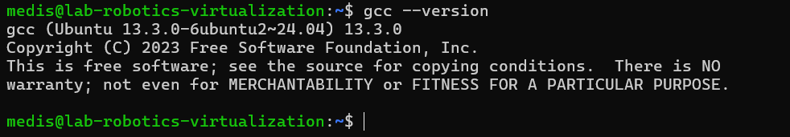

Creating and Writing the C Program (mycalc.c)

Navigate to your directory 
        mkdir -p calculator && cd calculator

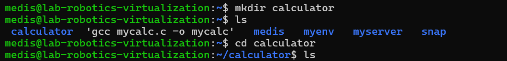

Create the mycalc.c file using nano:
        nano mycalc.c

Write a basic Hello World program first:

#include <stdio.h>
int main() {
    printf("Hello, World!\n");
    return 0;
}

        Save (Ctrl + S) and exit (Ctrl + X).

Compile the Hello World program:

        gcc mycalc.c -o mycalc

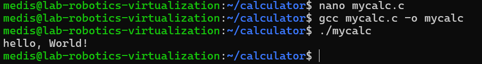

## Now we can modify to add our calculator codes.

Updating mycalc.c to Perform Addition

Open mycalc.c 

        nano mycalc.c

Modify the code to:

#include <stdio.h>

int main() {
    int num1, num2, sum;
    printf("Enter two numbers: ");
    scanf("%d %d", &num1, &num2);
    sum = num1 + num2;
    printf("Sum: %d\n", sum);
    return 0;
}

Save (Ctrl + S) and exit (Ctrl + X).

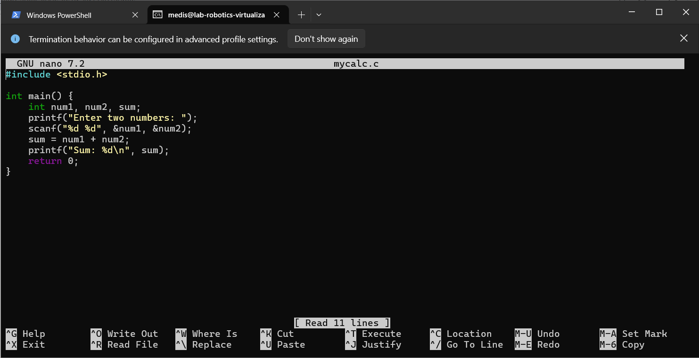

Recompile:

        gcc mycalc.c -o mycalc

Run the updated program:

        ./mycalc

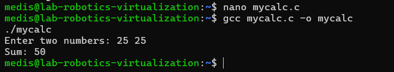

2. Install Node.js and npm.

Install Node.js and npm. Make a new directory "myserver", cd there and install Express web server
Copy example javascript code to "myserver.js" and modify it to use also route "/user" that returns information about client user (Hint: use process.env)

Update your package list and install Node.js with npm:

sudo apt update && sudo apt upgrade -y
curl -fsSL https://deb.nodesource.com/setup_18.x | sudo -E bash -
sudo apt install -y nodejs

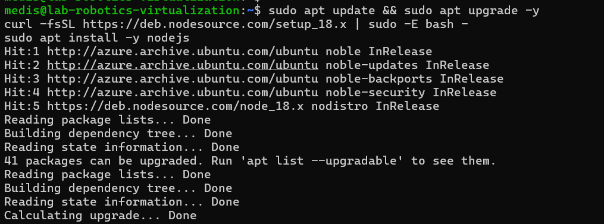

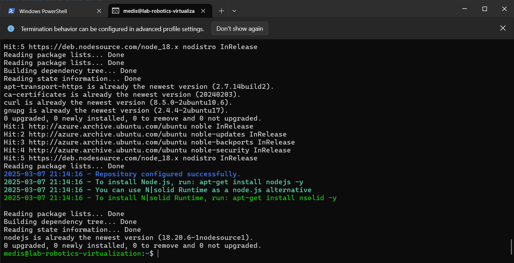

Check installation:

node -v
npm -v

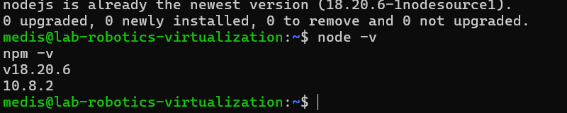

Create a New Directory and Install Express

mkdir myserver && cd myserver
npm init -y  # Create a package.json file
npm install express  # Install Express web server

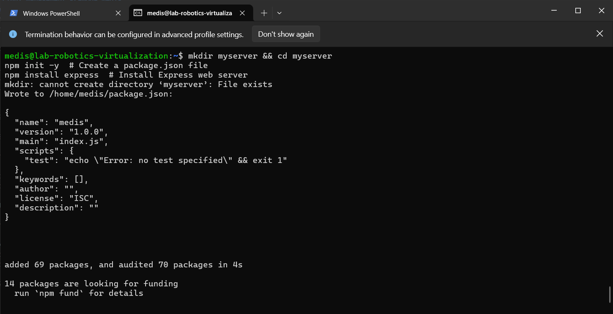

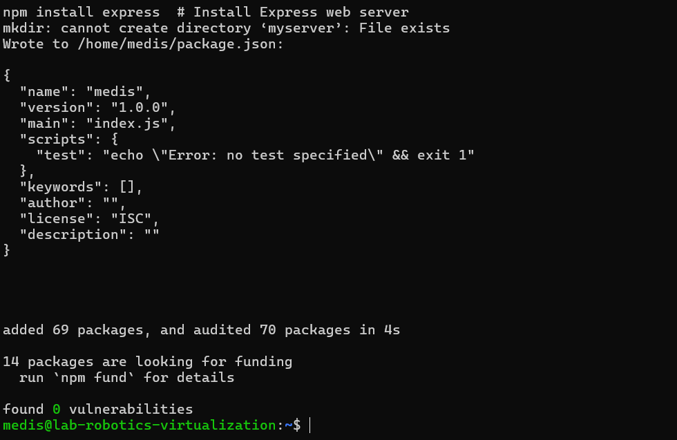

Install the node package express and update the index

npm install express

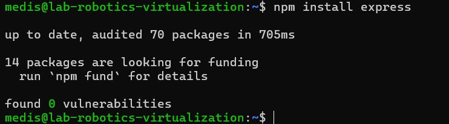

Following is the basic code of node js server

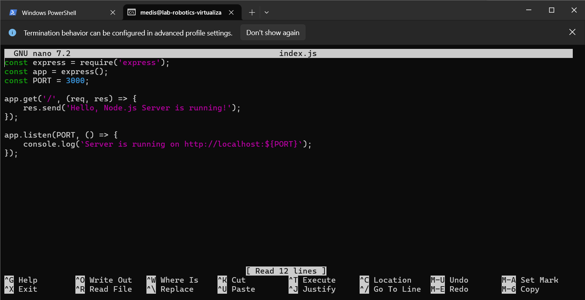

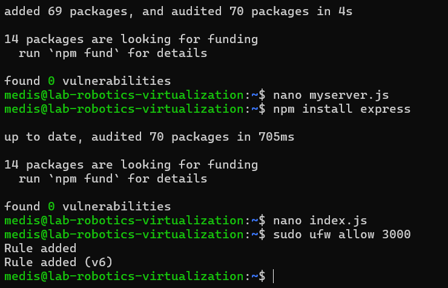

Update the firewall settings so that the port can be viewed from outside connections

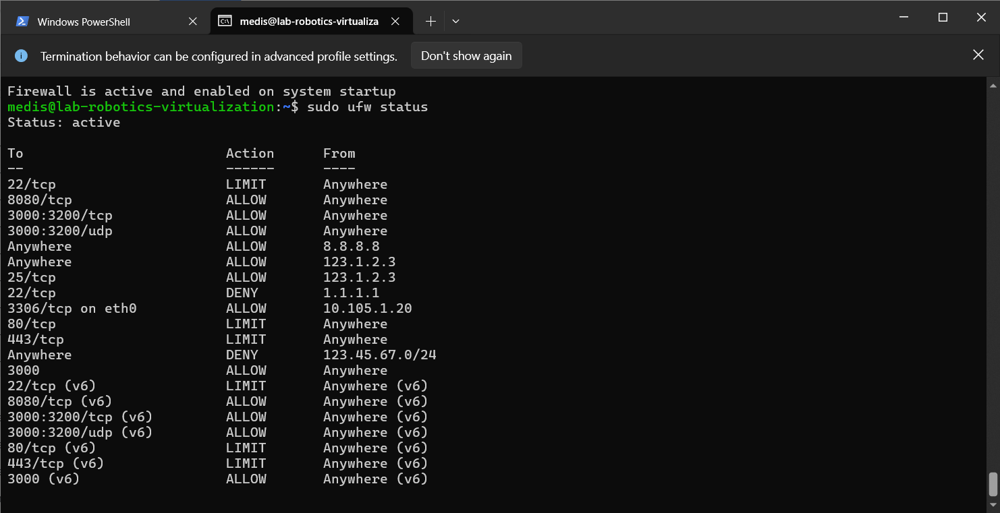

3. Install python3 and pip

Run the following command to install Python 3 and pip:

sudo apt update && sudo apt install -y python3 python3-pip

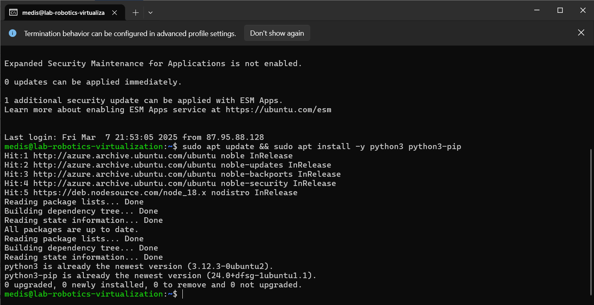

Check the python and pip version. 

python3 --version
pip3 --version

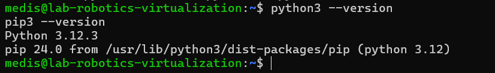

Install bpytop

pip3 install bpytop --break-system-packages

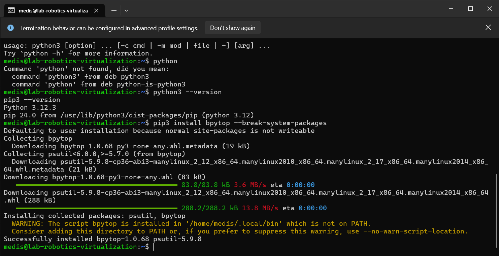

sudo apt install python3-venv

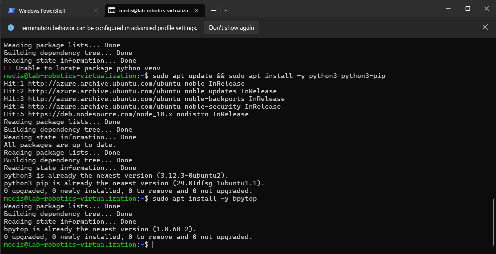

Create and activate Virtual Environment:

Now install bpytop inside the VM and run it,

got an error message 

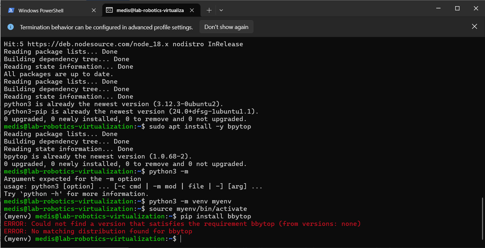

