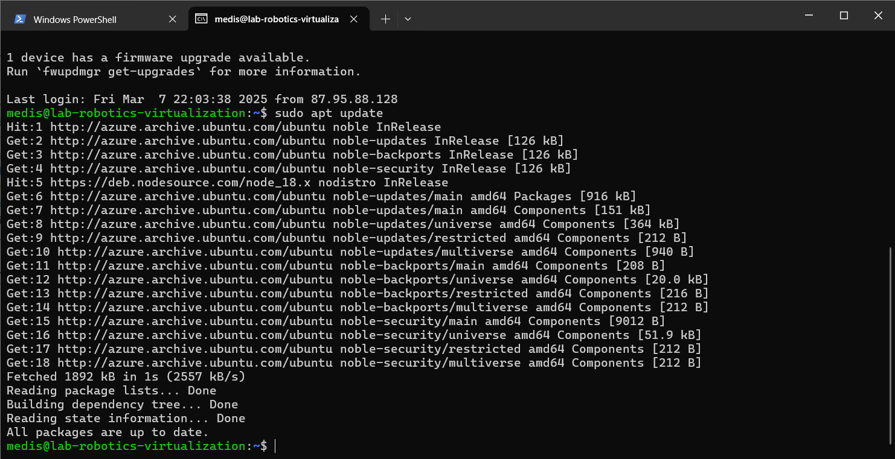
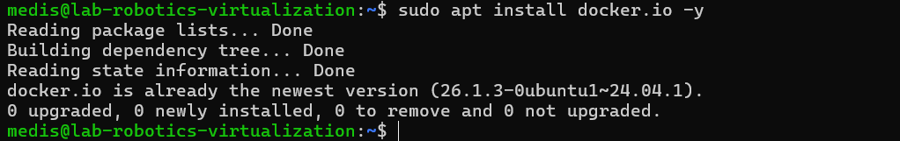
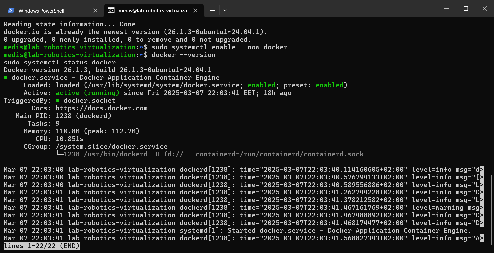
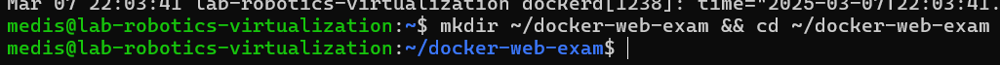
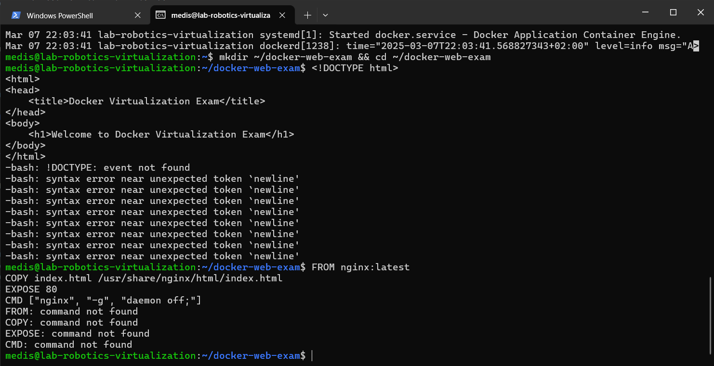
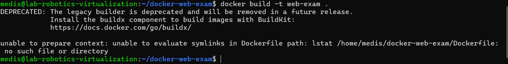
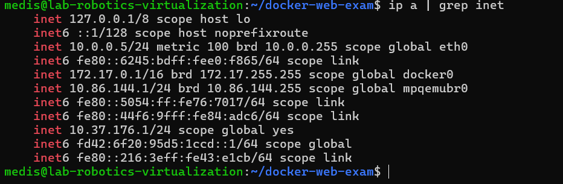
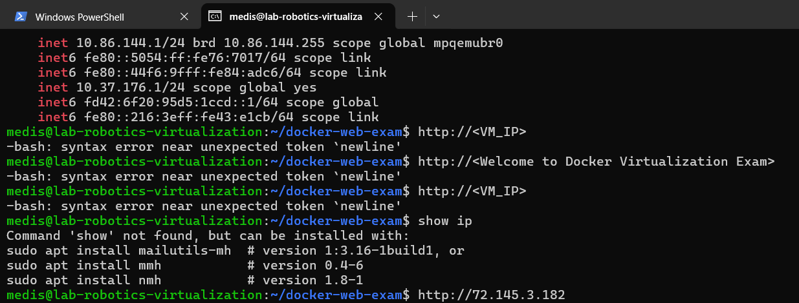

# Linux Management_Pramoda Medis
 
## Docker Virtualization Exam -Question 03

Task Overview

This task involves setting up and deploying a simple web application using Docker on a Linux virtual machine (VM). Below are the steps to be performed:

1. Install Docker on the Linux Virtual Machine

Update package lists:

        sudo apt update

Install Docker:

        sudo apt install docker.io -y

Enable and start Docker service:

        sudo systemctl enable --now docker

Verify Docker installation:

        docker --version

        sudo systemctl status docker

2. Create a Dockerfile for the Web Application

Create a working directory:

        mkdir ~/docker-web-exam && cd ~/docker-web-exam

Create an index.html file with the following content:

<!DOCTYPE html>
<html>
<head>
    <title>Docker Virtualization Exam</title>
</head>
<body>
    <h1>Welcome to Docker Virtualization Exam</h1>
</body>
</html>

Create a Dockerfile with the following content:

FROM nginx:latest
COPY index.html /usr/share/nginx/html/index.html
EXPOSE 80
CMD ["nginx", "-g", "daemon off;"]

3. Build the Docker Image

Build the Docker image and name it web-exam:

        docker build -t web-exam .

4. Run a Docker Container

Run a container from the web-exam image and expose it on port 80:

        docker run -d -p 80:80 --name web-container web-exam

Verify that the container is running:

docker ps

5. Verify Web Application Accessibility

Find the VM's IP address:

ip a | grep inet

Open a web browser from another machine and navigate to:

http://<VM_IP>

Ensure the page displays "Welcome to Docker Virtualization Exam".

6. Document the Process

Take screenshots for each step, including:

Docker installation verification

Dockerfile creation

Docker image build

Running container verification

Web application running in a browser

Compile the documentation into a PowerPoint or PDF, including:

Commands used

IP address or DNS hostname used to access the web app

Screenshots

Attach the final document to the task submission.

