### Linux Management_Pramoda Medis

## Assignment 07 - Linux Virtualization Exercise

#### Part 1: Introduction to virtualization concepts

Differences Between Virtual Machines (VMs) and Containers

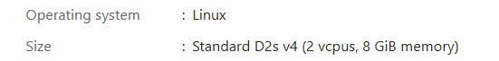

    cat /proc/cpuinfo

    sudo apt install cpu-checker

    sudo kvm-ok

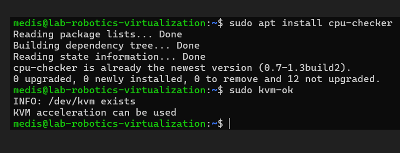

#### Research: Using sources (Sources linked at the end of the task), learn about the following concepts:

1. Virtualization
Concept of creating virtualized computing environments.

Types: Full, Para, and Hardware-assisted virtualization.

2. Hypervisor
Software layer enabling virtualization.

Type 1 Hypervisors (Bare-metal): KVM, VMware ESXi.

Type 2 Hypervisors (Hosted): VirtualBox, VMware Workstation.

3. Virtual Machines (VMs)
Fully virtualized OS environments.

Use virtualized hardware components.

4. Containers
Lightweight, share host OS kernel.

Faster than VMs but with reduced isolation.

5. Main Differences Between VMs and Containers
Architecture: VMs virtualize hardware; Containers share OS kernel.

Resource Utilization: VMs use more resources; Containers are lightweight.

Isolation: VMs provide stronger isolation.

#### Part 2: Working with Multipass

Multipass is a command-line tool that allows you to quickly create and manage Ubuntu virtual machines.

## Installation

        sudo snap install multipass

## Practice Basic Commands

        # Launch default Ubuntu instance
        multipass launch --name primary-vm

### Cloud-Init Customization

### List running instances

        multipass list

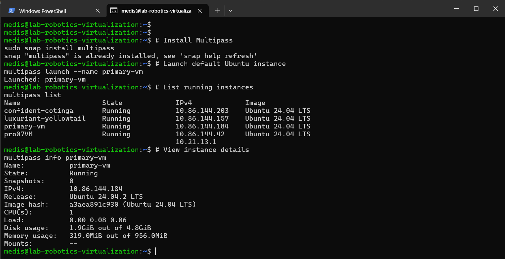

5. Access instance shell

        multipass shell primary-vm

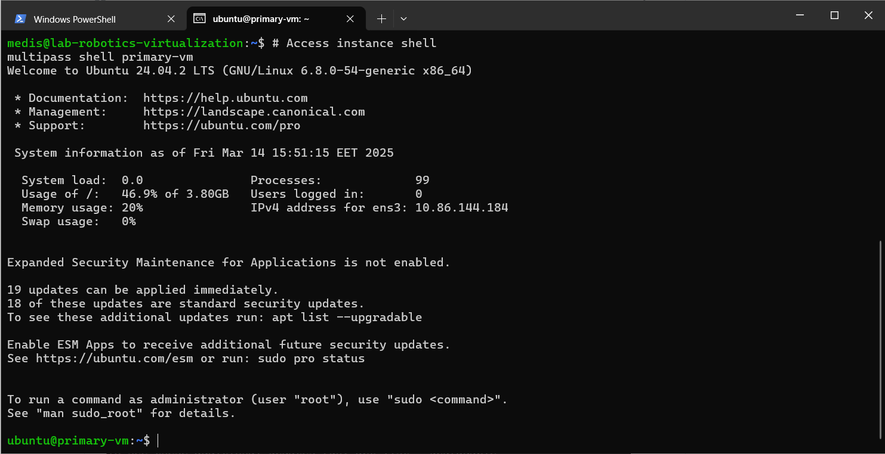

6.  Execute command on instance

        multipass exec primary-vm -- ls -la

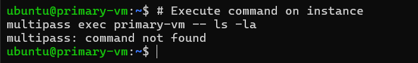

# Stop instance
multipass stop primary-vm

# Delete instance
multipass delete primary-vm

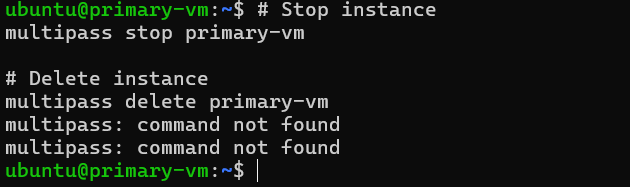

## Cloud-Init Customization

Start a New Instance with Multipass

Save the configuration as cloud-init

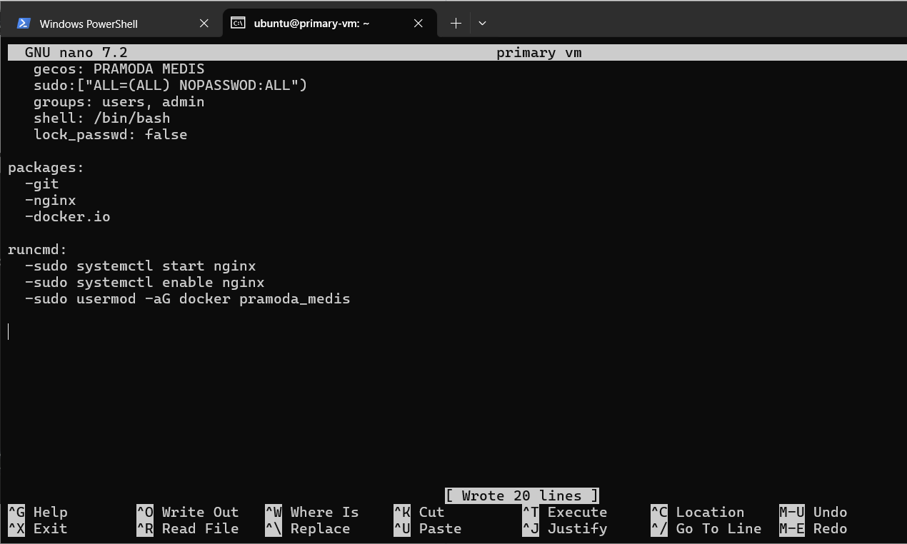

## To start a new instance using this cloud-init configuration, you can use the following multipass command:

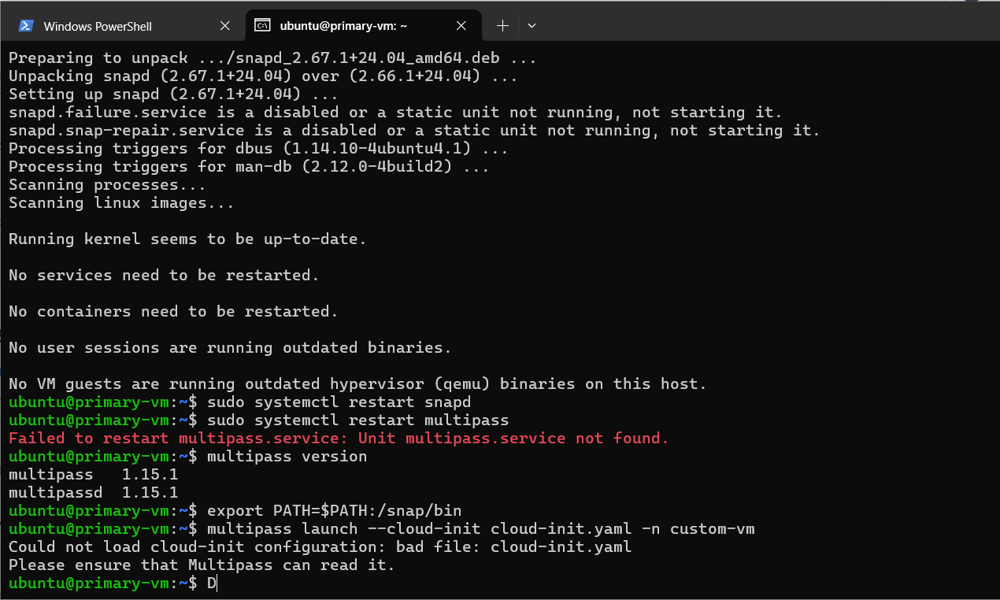

### File sharing

# Create shared directory
mkdir ~/shared-folder

# Mount to instance
multipass mount ~/shared-folder my-instance:/shared

### LXD Implementation

# Create container
lxc launch ubuntu:20.04 test-container

# List containers
lxc list

# Execute commands
lxc exec test-container -- apt update

# Stop container
lxc stop test-container

# Delete container
lxc delete test-container

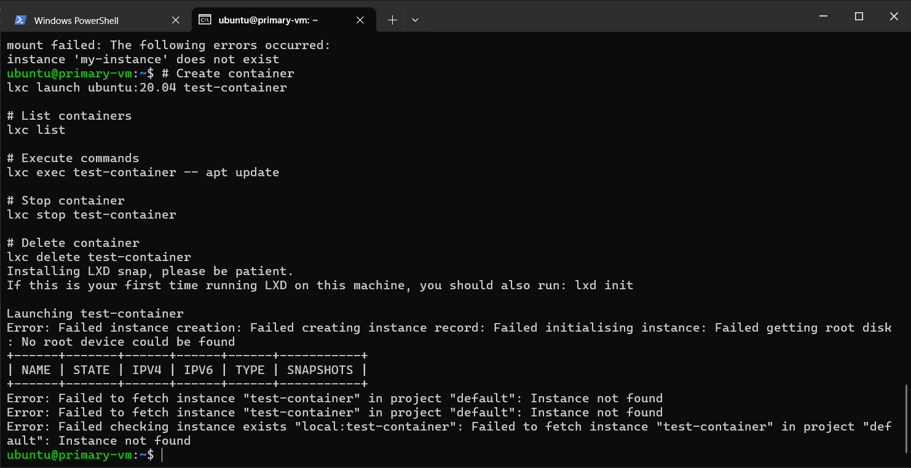

7. Docker Implementation

sudo apt update
sudo apt install docker.io -y
sudo systemctl start docker
sudo systemctl enable docker

Verify installation:

docker --version

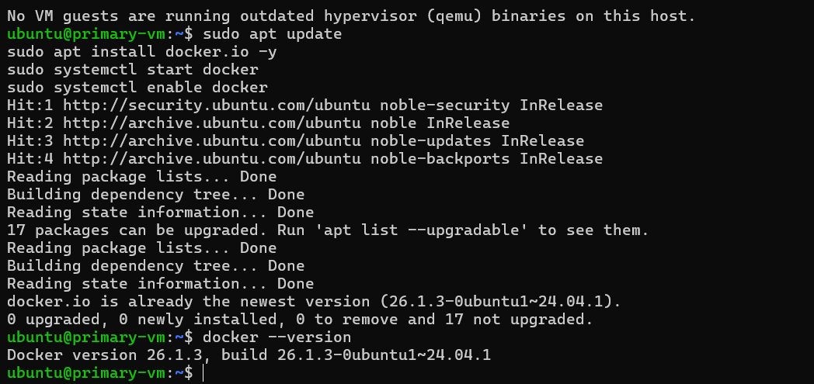

### Snaps

# Install Snapcraft

sudo snap install snapcraft --classic

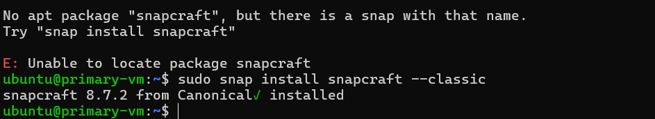

Create a Simple Snap
Create a project directory

mkdir my-snapcraft
cd my-snapcraft

Create the Application Script

make a simple Bash script that prints "Hello, Snap!".

mkdir bin
nano bin/hello-snap

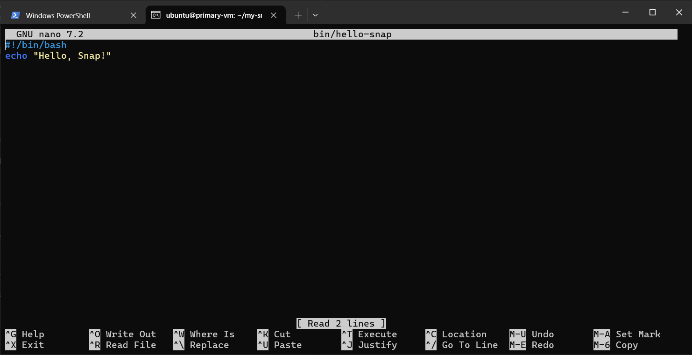

Create the snapcraft YAML file

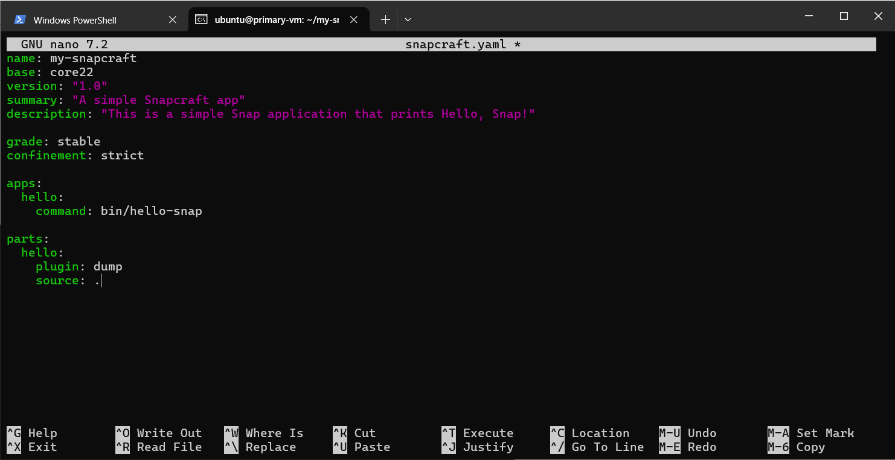

Build the snap package

        snapcraft

        sudo snap install my-snapcraft_1.0_amd64.snap --dangerous

        my-snapcraft.hello

        Hello, Snap!

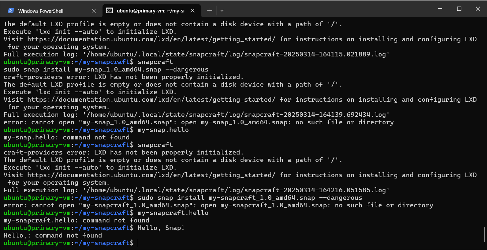
